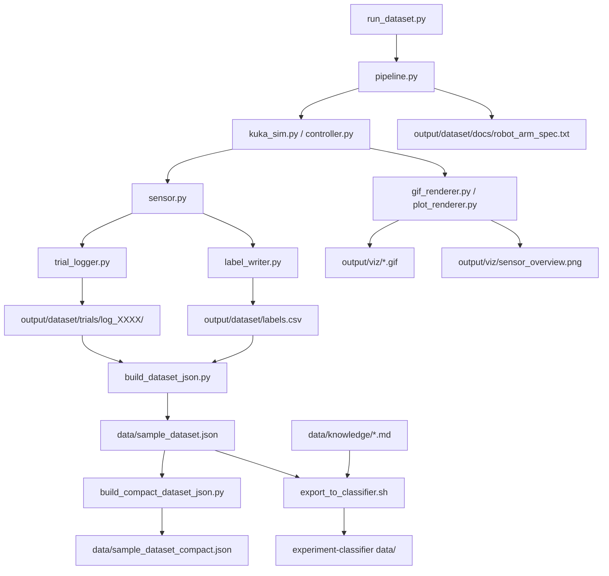
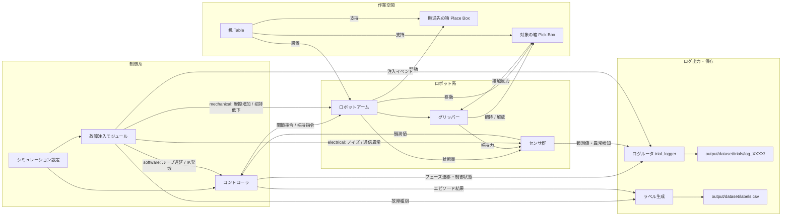

# robot-fault-sim

Kuka IIWA ロボットアームのピック&プレース故障シミュレーション。
ログテキスト・ナレッジベース・分類データセット（JSON）を生成し、
experiment-classifier へ渡すことを目的とする。

---

## データセットを作る手順

### Step 1: シミュレーション実行（ログ・ラベルの生成）

```bash
# 疎通確認（各カテゴリ 5 件、約 2〜3 分）
docker compose --profile quick up --build

# 本番生成（各カテゴリ 50 件、約 20 分）
docker compose up --build
```

生成物（中間ファイル）:

| パス | 内容 |
|------|------|
| `output/dataset/trials/log_XXXX/` | 各試行のログ群（下記の2層構成） |
| `output/dataset/labels.csv` | 試行 ID・故障種別の対応表（CSV） |
| `output/viz/*.gif` | 可視化 GIF |
| `output/viz/sensor_overview.png` | センサグラフ |

### 試行ディレクトリの構成（2層ログ）

1試行 = 1ディレクトリ。中央コントローラログ（要約・コンポーネント ID タグ付き）と、
各コンポーネントの詳細ログの2層で構成される。

```
output/dataset/trials/log_0001/
├── controller/
│   ├── main.log        # 中央コントローラログ（全コンポーネント横断・アラームはラッチ）
│   └── motion.csv      # 手先位置・IK残差・制御周期の時系列
├── components/
│   ├── servo/
│   │   ├── trace.csv   # 関節トルク・速度の時系列（J1〜J7）
│   │   └── alarms.log  # サーボ側アラーム詳細（全繰り返し）
│   ├── gripper/
│   │   └── events.log  # グリッパ開閉コマンド・把持力・イベント
│   └── fieldbus/
│       └── comm.log    # センサ通信リンクステータス
└── metadata.json       # 試行メタ情報（正解ラベルは含まない）
```

中央ログ `main.log` の各行は `[SRV-J2]` `[GRP-01]` `[BUS-01]` `[CTRL]` のような
**発生元コンポーネント ID タグ**を持つ。同一アラームは初回のみ記録（ラッチ）され、
繰り返しの全件は各コンポーネントログ側に残る。解析時は中央ログで異常箇所・時刻を
特定し、該当コンポーネントの詳細ログへ掘り下げる。

コンポーネント ID:

| タグ | コンポーネント |
|------|--------------|
| `CTRL` | 中央モーションコントローラ（シーケンス・IK・リアルタイムループ） |
| `SRV-01` / `SRV-J1`〜`SRV-J7` | サーボアンプ（ユニット / 軸別） |
| `GRP-01` | 2フィンガーグリッパ |
| `BUS-01` | センサフィールドバス |

### システムブロック図（ログ出力・保存経路）



### システムブロック図（構成要素ベース）



### Step 2: JSON データセットへ変換

```bash
python scripts/build_dataset_json.py
```

`output/dataset/labels.csv` + `output/dataset/trials/<log_id>/` を読み込み、
`data/sample_dataset.json` を生成する。各試行のログ群は `=== path ===` 区切りで
1テキストにバンドルされる（CSV 時系列は 20 行ごとに間引き）。

**ラベル正規化ルール:**

| CSV の `label` 値 | JSON の `ground_truth` |
|---|---|
| `normal` | `[]` |
| `mechanical_*`（pad_wear / bearing / actuator / combined） | `["mechanical"]` |
| `electrical` | `["electrical"]` |
| `software` | `["software"]` |

### Step 3: experiment-classifier へエクスポート

```bash
bash scripts/export_to_classifier.sh [path/to/experiment-classifier]
```

内部で Step 2 を自動実行し、以下をコピーする:

- `data/sample_dataset.json` → `$DEST/data/`
- `data/knowledge/*.md` → `$DEST/data/knowledge/`

---

## 生成物（ターゲット形式）

| パス | 内容 | 用途 |
|------|------|------|
| `data/sample_dataset.json` | 分類データセット（JSON 配列） | experiment-classifier のバッチ実行 |
| `data/knowledge/*.md` | ナレッジベース（トピック別 MD） | Knowledge ページへ登録 |
| `data/eval_results/<run_id>/` | バッチ評価結果 | 精度比較 |
| `data/experiments/<experiment_id>/` | 実験設定・分類結果 | 再現・比較 |

### `data/sample_dataset.json` のスキーマ

```json
[
  {
    "log_id":       "log_0001",
    "log_text":     "<ログ本文（複数行テキスト）>",
    "ground_truth": []
  },
  {
    "log_id":       "log_0051",
    "log_text":     "<ログ本文>",
    "ground_truth": ["mechanical"]
  }
]
```

---

## フォルダ構成

```
robot-fault-sim/
├── Dockerfile
├── docker-compose.yml
├── requirements.txt
├── config/
│   └── sim_config.yaml              # 件数・閾値・故障パラメータ
├── specs/
│   └── robot_arm_spec.md            # 仕様書（参照用）
├── data/                            # ★ ターゲット形式の出力先
│   ├── sample_dataset.json          #   分類データセット（JSON）
│   ├── knowledge/                   #   ナレッジベース（トピック別）
│   │   ├── mechanical_trouble_signs.md
│   │   ├── electrical_trouble_signs.md
│   │   ├── software_trouble_signs.md
│   │   └── normal_operation_criteria.md
│   ├── eval_results/                #   バッチ評価結果
│   └── experiments/                 #   実験設定・分類結果
├── output/                          # シミュレーション中間出力
│   └── dataset/
│       ├── trials/log_XXXX/         #   1試行 = 1ディレクトリ（2層ログ）
│       ├── labels.csv
│       └── docs/robot_arm_spec.txt
├── src/
│   ├── simulation/
│   │   ├── controller.py            # ピック&プレース 6 フェーズ制御
│   │   └── kuka_sim.py              # Kuka シミュレーター
│   ├── monitoring/
│   │   ├── sensor.py                # 閾値超過検出 → SensorEvent
│   │   ├── trial_logger.py          # 2層ログ出力（中央 + コンポーネント別）
│   │   └── label_writer.py          # 正解ラベル CSV 出力
│   ├── visualization/
│   │   ├── gif_renderer.py          # GIF 生成
│   │   └── plot_renderer.py         # センサグラフ PNG 生成
│   └── pipeline.py                  # 統合実行
└── scripts/
    ├── run_dataset.py               # シミュレーション実行
    ├── build_dataset_json.py        # ★ CSV+ログ → JSON 変換
    └── export_to_classifier.sh      # ★ experiment-classifier へエクスポート
```

---

## 故障カテゴリ

| ラベル | 注入方法 | ログのキーワード |
|--------|---------|----------------|
| `mechanical` | 関節摩擦係数を増大・グリップ力低下 | `joint_torque_overload`, `torque_warning` |
| `electrical` | エンコーダノイズ付加・通信タイムアウト | `encoder_deviation`, `packet_timeout` |
| `software` | 制御ループ遅延・IK 発散 | `control_loop_overrun`, `ik_divergence` |
| *(正常)* | なし | `periodic_status` のみ → `ground_truth: []` |

---

## 件数・パラメータの変更

`config/sim_config.yaml` の `dataset` セクションを編集する:

```yaml
dataset:
  normal: 50      # 変更可能
  mechanical: 50
  electrical: 50
  software: 50
```
